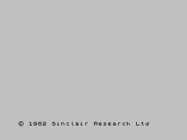

## ZX Spectrum Bulk Data Transfer

A set of tools for transferring arbitrary files (of arbitrary lengh, up
to 1Gb) to ZX Spectrum machine via tape input (EAR). No additional
hardware required.

t2esx utility is intended to transfer data to the ZX Spectrum via the
EAR port without any additional hardware. If you have the means to play
back TAP files, t2esx allows you to transfer any arbitrary amount of raw
data (theoretical upper limit – 1G). Utility provided in two flavours –
“regular” 48k programme and the esxdos dot command. There are no other
restrictions, utility uses standard ROM routine for loading data blocks
from the audio input port, so it works on any Spectrum model. It was
originally created for the Sizif-512 board, which allows up to 4x speed
increase during tape loading. 640K (TRD disk image) can be transferred
in less than 15 minutes at 4x speed. Utility uses very basic data stream
integrity control, allowing to re-start data transfer of a failed chunk.

The “regular” build enables data transfer with zero setup. One simply
concatenates the t2esx TAP file with the data file and send it to
Speccy. Of course, dot command has to be copied to the target Speccy
first.

### Preparing data file

Utility uses non-standard tape block identifiers, so data for transfer
must be prepared with the `split.py` script. split.py normally produces
a single TAP with 8K (when transferring less than 48k) or 16k data
chunks (see `--block_size` argument).  The maximum chunk size is 16K,
apparently bigger chunks reduce the time required to transmit data
headers and meta information.

`split.py` can insert placeholder blocks between data chunks, this is
required if Speccy’s storage device is unable to quickly save the chunk
(see `--pause` command line argument).

If your audio equipment is not reliable, “split” mode can be enabled
with the `--split` command line argument. Is this case split.py creates
a separate TAP file for each data chunk, simplifying retries. So far in
our limited testing there was no need to use it, you can simply loop the
data TAP file and eventually t2esx will load all the chunks.

Additional options generally required only if you want to use higher
than normal transfer speed (e.g. on Next running at 28MHz it is possible
to use 8x playback speed, but you may need --pause 2 or longer,
depending on your SD card write performance).

### t2esx output

t2esx utility displays the following status indicators (`n` means chunk
number):

- `?` – waiting for a header
- `O` - **o**pening file for writing
- `nL` – **l**oading data chunk number `n`
- `nS` – **s**aving data chunk number `n`
- `nE` – means there was an **e**rror while loading chunk `n`
- `!` – unexpected chunk number detected, code will keep loading headers
  looking for the right chunk

It is recommended to try split parameters on a short test file, two or
three chunks long.

Troubleshooting:

- slow disk subsystem
    - `O` still visible when the next HEADER block starts (note: since
      1.2 a short DATA block follows initial `OPEN_FILE` header). It
      means opening file takes too long. Let us know your
      hardware/software detaills (Spectrum model, Div\*\*\* model/make, SD
      card brand and capacity).  Workaround: just re-start upload,
      `t2esx` will ignore already processed parts.
    - `nL` still visible when the next block starts. Writing block takes
      too long, try reducing chunk size (unlikely to work) or
      increasing the pause duration
    - finally, it is possible that **all** disk operations may take very
      long time. Most likely the filesystem/card is too fragmented.
      Workaround: use `--split` option and manually start playback for
      each chunk.

“Tape” build has no input arguments and never overwrites target file
if it already exists. Dot command does not overwrite files by default,
and it accepts “`-f`” command line argument, which allows it to
unconditionally save target file, overwriting any existing data. RAMTOP
has to be manually adjusted before launching the dot command (using
regular `CLEAR NNNNN`), maximum suggested value reported by the utility
(`45055` at the moment).

### Example



Let's say we want to transfer the t2esx esxdos build to a Speccy:

1. On the host computer prepare source file `T2ESX`

```
$ ./split.py T2ESX
T2ESX size 3491 chunks: 1
Output: T2ESX.xchtap
Done with T2ESX
```

2. Transfer the TAP version and the data file to the Speccy:

```
$ cat t2esx.tap T2ESX.xchtap > _.tap
$ tape2wav -r 44100 _.tap - | pacat -p --format=u8 --channels=1 --rate=44100
```

And do not forget to do `LOAD ""` on Speccy :)

> *You may want to use `--device` if you have more than one audio sink*

You will see sometyhing like
```
t2esx v1.2 BulkTX (C) 2023 TIsland
'T2ESX' - 1 chunks
1
'T2ESX' DONE

[...]
9 STOP statement, 10:2
```

3. On the Speccy check newly uploaded `t2esx` dot command:

```
.ls t2esx
t2esx                   3491 DD.MM.YYYY
```

4. If you try uploading the same TAP again you will see

```
[...]
Can't open 'T2ESX' 18
[...]
```

Tape version does not overwrite the target file, you need to move/delete
it first. Dot command has `-f` command line argument enabling
unconditional overwrites. This is how you may want to replace t2esx in
the `/BIN` directory (assuming you you already have the previous version
there):

```
.cd /bin
.t2esx -f
```

And on your host just play `T2ESX.xchtap`

Dot command may display the following message:

```
t2esx v1.2 BulkTX (C) 2023 TIsland
M RAMTOP no good (45055)
```

It means you need to move `RAMTOP` at least to the address suggsted by
the `t2esx`, e.g. `CLEAR 45055`. Tape version sets RAMTOP in the BASIC
loader, but for the dot command it has to be adjusted manually.
